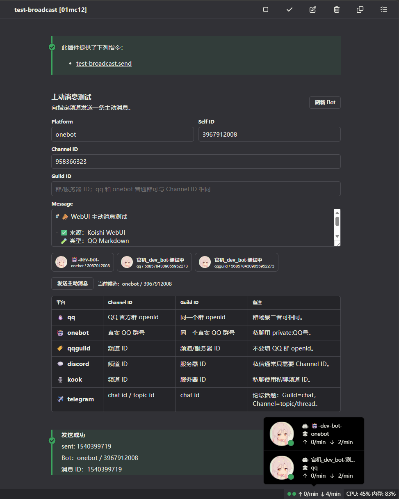
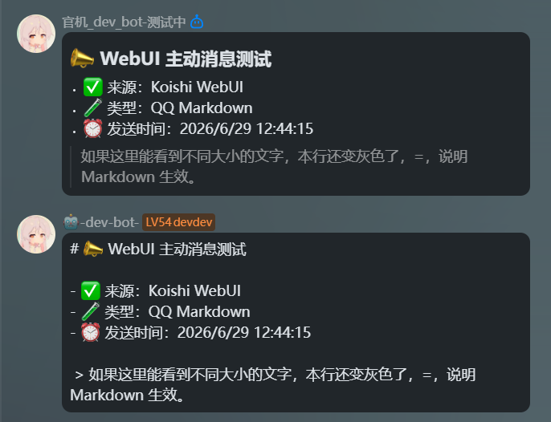

# koishi-plugin-test-broadcast

📣 用于快速验证 Koishi 的主动消息发送能力，尤其是 QQ 官方 Bot 平台。支持从插件配置页 WebUI 或指令触发，方便确认 `qq`、`onebot`、`discord` 等适配器是否能按目标频道主动发消息。✨

---

[](https://www.npmjs.com/package/koishi-plugin-test-broadcast)
[](https://www.npmjs.com/package/koishi-plugin-test-broadcast)

[](https://koishi.chat/zh-CN/market/)

[](https://github.com/VincentZyuApps/koishi-plugin-test-broadcast)
[](https://gitee.com/vincent-zyu/koishi-plugin-test-broadcast)

[](https://forum.koishi.xyz/t/topic/12640)
[](https://qm.qq.com/q/ZN7fxZ3qCq)

<h2>💬 交流反馈</h2>
<p>🐛 Bug 反馈 / 💡 建议 / 👨‍💻 插件开发交流，欢迎加群：</p>
<p><del>💬 插件使用问题 / 🐛 Bug反馈 / 👨‍💻 插件开发交流，欢迎加入QQ群：<b>259248174</b>   🎉（这个群G了）</del></p> 
<p>💬 插件使用问题 / 🐛 Bug反馈 / 👨‍💻 插件开发交流，欢迎加入QQ群：<b>1085190201</b> 🎉</p>
<p>💡 在群里直接艾特我，回复的更快哦~ ✨</p>

---

## 功能

- 支持选择目标平台、Bot selfId、Channel ID、Guild ID。
- 默认目标支持表格配置；`selfId` 留空时默认会尝试同平台所有 Bot，可用 `useFirstBotWhenSelfIdEmpty` 改为只使用第一个匹配 Bot。
- 支持配置默认消息模板，内置 `{{source}}`、`{{time}}` 占位符。
- 支持启动后延迟发送，用于检查 Koishi 启动后主动消息是否可用。
- QQ 官方 Bot 平台支持 Markdown 主动消息，优先走 `qq:rawmarkdown-without-keyboard`，失败后 fallback 到 `bot.internal.sendMessage()`。
- WebUI 会列出当前可用 Bot，减少填错平台和 selfId 的概率。

## 快速使用

在 Koishi 控制台安装并启用插件后，可以通过指令测试：

```text
test-broadcast.send -p qq -c GROUP_OPENID "# 主动消息测试"
```

OneBot 群聊测试：

```text
test-broadcast.send -p onebot -c 958366323 测试消息
```

常用参数：

| 参数 | 说明 |
| --- | --- |
| `-p, --platform` | 目标平台，例如 `qq`、`onebot`、`qqguild` |
| `-s, --self-id` | 指定 Bot 自身 ID |
| `-c, --channel-id` | 目标 Channel ID |
| `-g, --guild-id` | 目标 Guild ID |
| `-m, --message` | 消息内容 |

## QQ 官方 Bot 主动消息说明

QQ 官方 Bot 的普通群接口使用的是群 `openid`，不是传统 QQ 群号。

| 平台 | 目标 | Channel ID 应填 |
| --- | --- | --- |
| `qq` | 普通 QQ 群 | QQ 官方群 `group_openid` |
| `qq` | C2C 私聊 | `private:USER_OPENID` 或 adapter 内部处理后的私聊目标 |
| `onebot` | 普通 QQ 群 | 真实 QQ 群号 |
| `qqguild` | QQ 频道 | 真实频道 ID |

如果你把 QQ 官方群 openid 填给 `onebot`，或者把 QQ 群 openid 填给 `qqguild`，插件会尽量给出明确提示。

更详细的接口总结见：

- [`docs/dev/20260629.总结qq官方bot发送主动消息/20260629.总结qq官方bot发送主动消息.md`](docs/dev/20260629.总结qq官方bot发送主动消息/20260629.总结qq官方bot发送主动消息.md)
- [`docs/dev/20260629.总结qq官方bot发送主动消息/20260629.总结qq官方bot发送主动消息.精简版.md`](docs/dev/20260629.总结qq官方bot发送主动消息/20260629.总结qq官方bot发送主动消息.精简版.md)

## WebUI 预览

配置页可以直接选择 Bot、填写目标、发送测试消息。



## 发送效果

QQ / OneBot 主动消息测试截图：



## Works on my machine

这张图是调侃：在我的机器上已经能跑通。如果别人照着配置跑不起来，大概率需要先检查适配器、目标 ID、权限、Markdown 能力、QQ 官方 Bot 审核/灰度等配置差异。

OneBot 和 QQ 官方 Bot 的接口调用路径是统一封装的。这里能实现，按相同参数和目标 ID 复现，理论上也应该能跑通。


## 交流反馈

Bug 反馈、建议、插件开发交流可以加 QQ 群：`1085190201`。
